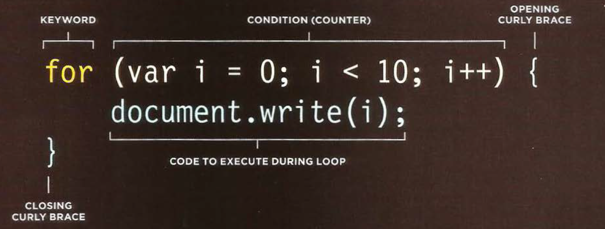

# Duckett HTML book
## Chapter 3: “Lists”
* There are lots of occasions when we
need to use lists. HTML provides us with
three different types:
 1. Ordered lists are lists where each item in the list is
numbered.

 
 

 2. Unordered lists are lists that begin with a bullet point

 3. Definition lists are made up of a set of terms along with the
definitions for each of those terms.

* Lists can be nested inside one another.

## Chapter 13: “Boxes”

* CSS treats each HTML e XX lement as if it has its own box.
* You can use CSS to control the dimensions of a box.

  

* Every box has three available properties that
can be adjusted to control its appearance:
1. border
2. margin
3. padding

* You can also control the borders, margin and padding
for each box with CSS.

  

* Block-level boxes can be made into inline boxes, and
inline boxes made into block-level boxes.

# Duckett JS book
## Chapter 2: “Basic JavaScript Instructions”
* An array is a special type of variable. It doesn't
just store one value; it stores a list of values.
* CREATING AN ARRAY

                               

* ACCESSING & CHANGING VALUES IN AN ARRAY

 

## Chapter 4: “Decisions and Loops”
* A switch statement starts with a
variable called the switch value.
Each case indicates a possible
value for this variable and the
code that should run if the
variable matches that value.

 

* Due to type coercion, every value in JavaScript
can be treated as if it were true or false; and
this has some interesting side effects.

 
 

* There are three types of loop:

 
 
 

1. for

 

2. while

 

3. do ... while

 

