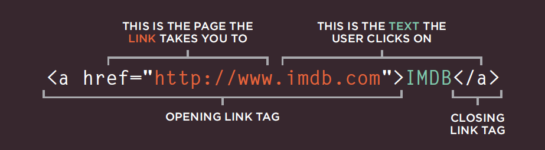
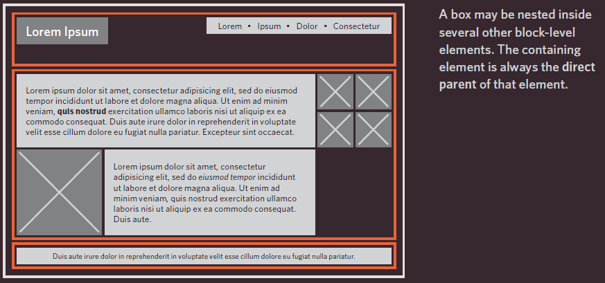
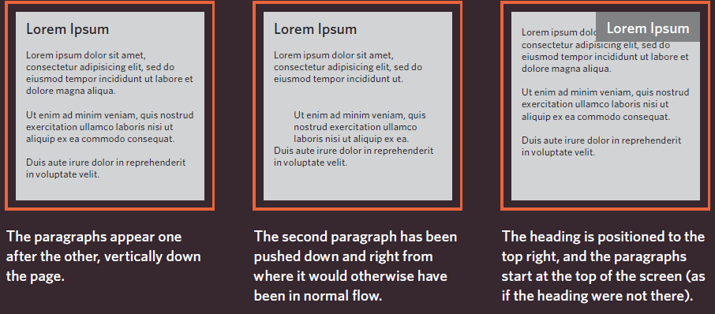
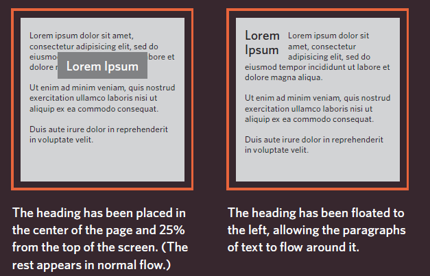
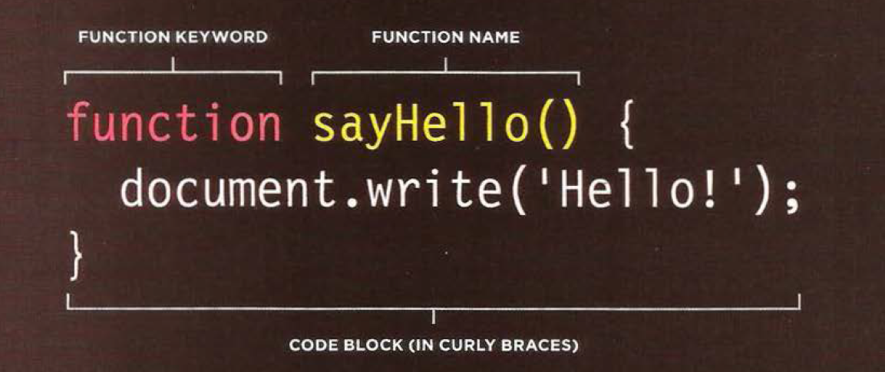
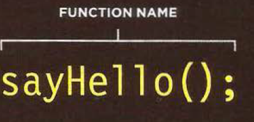
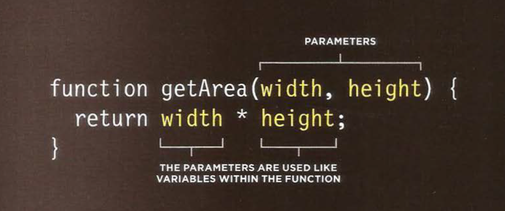
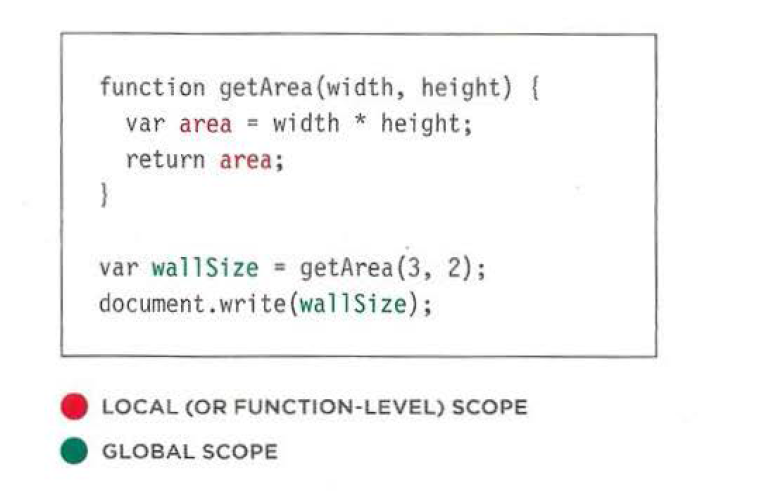

# Readings : HTML Links, JS Functions, and Intro to CSS Layout
## Duckett HTML book
## Chapter 4:“Links"
* Links are created using the `<a>` element.
* The `<a>` element uses the href attribute to indicate
the page you are linking to.

## Chapter 15: “Layout”
* CSS treats each HTML element as if it is in its
own box. This box will either be a block-level
box or an inline box.
* Block-level elements
start on a new line
Examples include:
`<h1> 
 <ul> <li>`
* Inline elements
flow in between
surrounding text
Examples include:
` <b> <i>`
* If one block-level element sits inside another
block-level element then the outer box is
known as the containing or parent element.

* It is common to group a number of elements together inside a` 
`
(or other block-level) element. For example, you might group together
all of the elements that form the header of a site (such as the logo and
the main navigation). The `
` element that contains this group of
elements is then referred to as the containing element.

* The orange lines in this diagram represent `
` elements. The
header (containing the logo and navigation) are in one `
` element,
the main content of the page is in another, and the footer is in a third.
The `<body>` element is the containing element for these three `
`
elements. The second `
` element is the containing element for two
paragraphs of Latin text and images (represented by crossed squares).

* CSS has the following positioning schemes that allow you to control
the layout of a page: normal flow, relative positioning, and absolute
positioning. You specify the positioning scheme using the position
property in CSS. You can also float elements using the float property.

* CSS has the following positioning schemes that allow you to control
the layout of a page: normal flow, relative positioning, and absolute
positioning. You specify the positioning scheme using the position
property in CSS. You can also float elements using the float property.
 1. Normal flow         2. Relative Positioning           3. Absolute positioning
 

 4.Fixed Positioning     5. Floating Elements
 

 ## Chapter 3: “Functions, Methods, and Objects”
* Programmers use
functions, methods, and objects to organize their code.
* Functions let you group a series of statements together to perform a
specific task. If different parts of a script repeat the same task, you can
reuse the function (rather than repeating the same set of st atements).
* To decalre a function

* To call a function

* To decalre a function that need information

* **VARIABLE SCOPE**
* The location where you declare a variable will affect where it can be used
within your code. If you declare it within a function, it can only be used
within that function. This is known as the variable's scope.

* LOCAL VARIABLES
When a variable is created inside a function using the
var keyword, it can only be used in that function.
It is called a local variable or function-level variable.
* GLOBAL VARIABLES
If you create a variable outside of a function, then it
can be used anywhere within the script. It is called a
global variable and has global scope. In the example
shown, wa 11 Size is a global variable.

## 6 Reasons for Pair Programming
* How does pair programming work?
pair programming commonly involves two roles: the Driver and the Navigator.
The Driver is the programmer who is typing and the only one whose hands are on the keyboard.
The Navigator thinks about the big picture, what comes next, how an algorithm might be converted in to code, while scanning for typos or bugs.

* Why pair program?
1. Greater efficiency
when two people focus on the same code base, it is easier to catch mistakes in the making.
2. Engaged collaboration
When two programmers focus on the same code, the experience is more engaging and both programmers are more focused than if they were working alone
3. Learning from fellow students
Everyone has a different approach to problem solving; working with a teammate can expose developers to techniques they otherwise would not have thought of.
4. Social skills
Pair programming is great for improving social skills. When working with someone who has a different coding style, communication is key.
5. Job interview readiness
A common step in many interview processes involves pair programming between a current employee and an applicant, either in person or through a shared screen.
