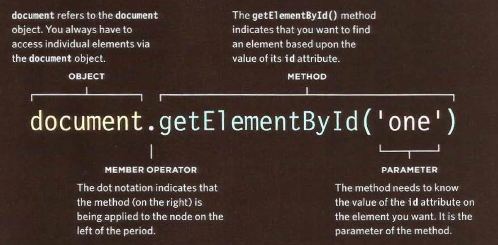

# Readings : Problem Domain, Objects, and the DOM
## Understanding The Problem Domain Is The Hardest Part Of Programming
* I’ve found the single hardest thing about programming is learning the problem domain.
* when you treat with familar problem domain,the codeing is become easier.
* The real world is a messy place.  Many of the problem domains we face as programmers are difficult to understand and look completely different depending on your viewpoint.

* As programmers, we also are often not given complete information about the problem domain, so we don’t even have the information we need to understand it.
*  if you want to make programming easier, you can do one of two things:

1. Make the problem domain easier
You can often make the problem domain easier by cutting out cases and narrowing your focus to a particular part of the problem.
2. Get better at understanding the problem domain
## Chapter 3: “Object Literals”
* Objects group together a set of variables and functions to create a model
of a something you would recognize from the real world.
* IN AN OBJECT: VARIABLES BECOME KNOWN AS PROPERTIES.
If a variable is part of an object, it is called a
property. Properties te ll us about the object, such as
the name of a hotel or the number of rooms it has.
* IN AN OBJECT: FUNCTIONS BECOME KNOWN AS METHODS
If a function is part of an object, it is called a method.
Methods represent tasks that are associated with
the object.
* This object represents a hotel. It has five properties and one method.
The object is in curly braces. It is stored in a variable called hotel .

* Creating an object :Literal notation
Literal notation is the easiest and most popular method to create objects.

* Accessing An object And Dot notation
you access the properties and methods of object using dot notation.
you also can access the properties using sequare bracktes.

## Chapter 5: “Document Object Model"
* The browser represents the page using a DOM tree.
* DOM trees have four types of nodes: document nodes,
element nodes, attribute nodes, and text nodes.

* You can select element nodes by their id or class
attributes, by tag name, or using CSS selector syntax.

* Whenever a DOM query can return more than one
node, it will always return a Node List.

* From an element node, you can access and update its
content using properties such as textContent and
innerHTML or using DOM manipulation techniques.
* An element node can contain multiple text nodes and
child elements that are siblings of each other.
* In older browsers, implementation of the DOM is
inconsistent (and is a popular reason for using jQuery).
* Browsers offer tools for viewing the DOM tree .
