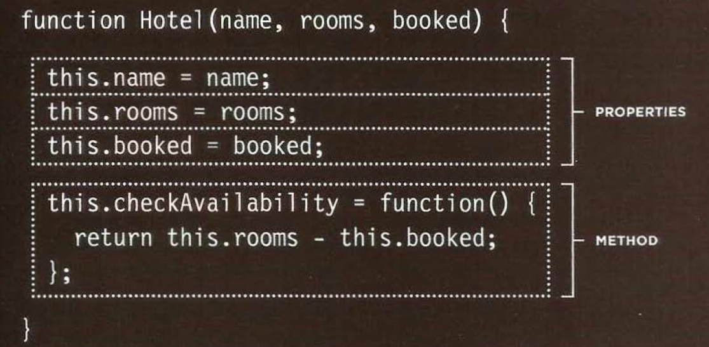

# Readings : Object-Oriented Programming, HTML Tables
## Domain Modeling
* Domain modeling is the process of creating a conceptual model in code for a specific problem. A model describes the various entities, their attributes and behaviors, as well as the constraints that govern the problem domain. An entity that stores data in properties and encapsulates behaviors in methods is commonly referred to as an object-oriented model.
* A domain model that's articulated well can verify and validate the understanding of a specific problem among various stakeholders. As a communication tool, it defines a vocabulary that can be used within and between both technical and business teams.
* Here's some tips to follow when building your own domain models.

1. When modeling a single entity that'll have many instances, build self-contained objects with the same attributes and behaviors.
2. Model its attributes with a constructor function that defines and initializes properties.
3. Model its behaviors with small methods that focus on doing one job well.
4. Create instances using the new keyword followed by a call to a constructor function.
5. Store the newly created object in a variable so you can access its properties and methods from outside.
6. Use the this variable within methods so you can access the object's properties and methods from inside.

## Duckett HTML book
## Chapter 6: “Tables”
* The `<table>` element is used to add tables to a web
page.
* A table is drawn out row by row. Each row is created
with the `<tr>` element.

* Inside each row there are a number of cells
represented by the `<td>` element (or `<th>` if it is a
header).

* You can make cells of a table span more than one row
or column using the rowspan and colspan attributes.
* For long tables you can split the table into a `<thead>`,
`<tbody>`, and `<tfoot>`.
## Duckett JS Book
## Chapter 3: “Functions, Methods, and Objects”
* Creating an object using constructor notation.
The **new** keyword and the object constructor create a blank object.

 
 * Updating an object
 to update the of proprties of an object we use dot notation or sequare brackets.
 

* Object constructors can use a function as a template for creating objects.

* And then to create objects we use **new** key word followed by call instuctor function and pass the values of properties as argument.

* THIS (IT IS A KEYWORD)
It refers to object that it define inside.
* there are three types of built-in object
1. THE BROWSER OBJECT MODEL:THE WINDOW OBJECT

2. THE DOCUMENT OBJECT MODEL: THE DOCUMENT OBJECT

3. GLOBAL OBJECTS

