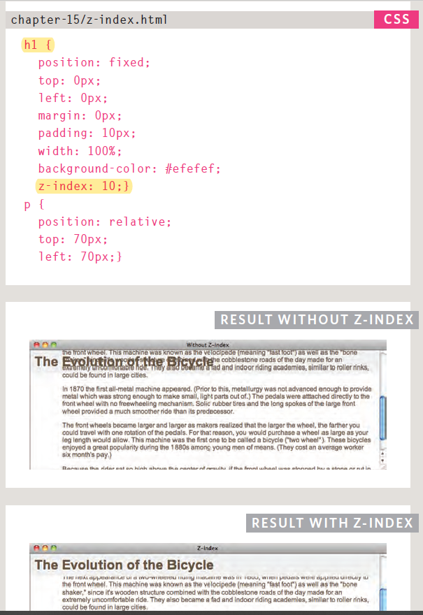
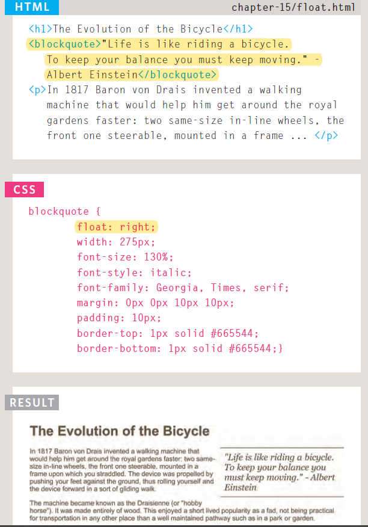
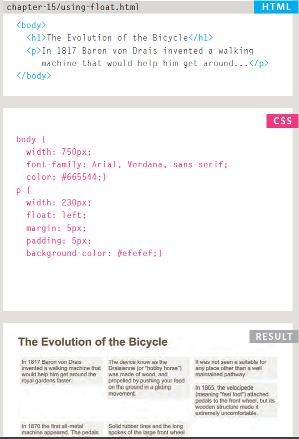

# Readings : CSS Layout
## Duckett HTML book
## Ch. 15, “Layout”
* Overlapping Elements: z-index :
The z-index is sometimes
referred to as the stacking context (as if the blocks have
been stacked on top of each other on a z axis).

* The float property moves content to the left or right
of the page and can be used to create multi-column
layouts. (Floated items require a defined width.)

* Floating Elements:float                                       
* The float property allows you
to take an element in normal
flow and place it as far to the
left or right of the containing
element as possible.
* Anything else that sits inside
the containing element will
flow around the element that is
floated.
* The `<blockquote>` element
is floated to the right, and the
paragraphs that follow the quote
flow around the floated element.

 

* Using Float to Place Elements Side-by-Side
A lot of layouts place boxes next to each other. The float
property is commonly used to achieve this.

 

 * Screen Sizes: 
 Different visitors to your site will have different sized screens that show
different amounts of information, so your design needs to be able to
work on a range of different sized screens.

* Screen Resolution:
Resolution refers to the number of dots a screen shows per inch. Some
devices have a higher resolution than desktop computers and most
operating systems allow users to adjust the resolution of their screens.

* Page Sizes:
Because screen sizes and display resolutions vary so much, web
designers often try to create pages of around 960-1000 pixels wide
(since most users will be able to see designs this wide on their screens).

* Fixed Width Layouts
Fixed width layout designs do not change size as the user increases or decreases
the size of their browser window.Measurements tend to be given in pixels.

* Liquid Layouts
Liquid layout designs stretch and contract as the user increases
or decreases the size of their browser window. They tend to use percentages.

