# Readings : Forms and JS Events
## Duckett HTML book
## Chapter 7: “Forms”
* There are several types of form controls that
you can use to collect information from visitors
to your site.

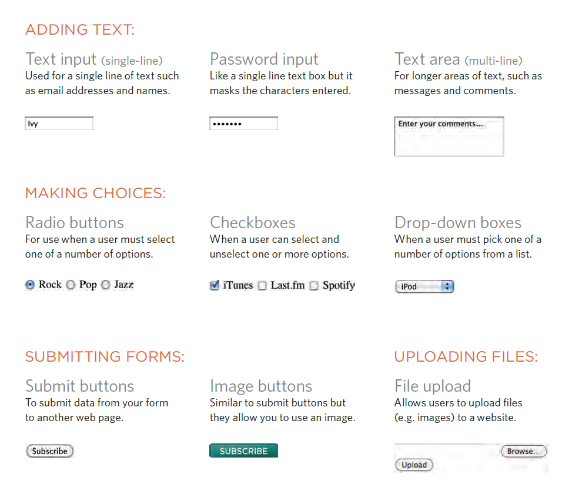

* How Forms Work: 
A user fills in a form and then presses a button
to submit the information to the server.

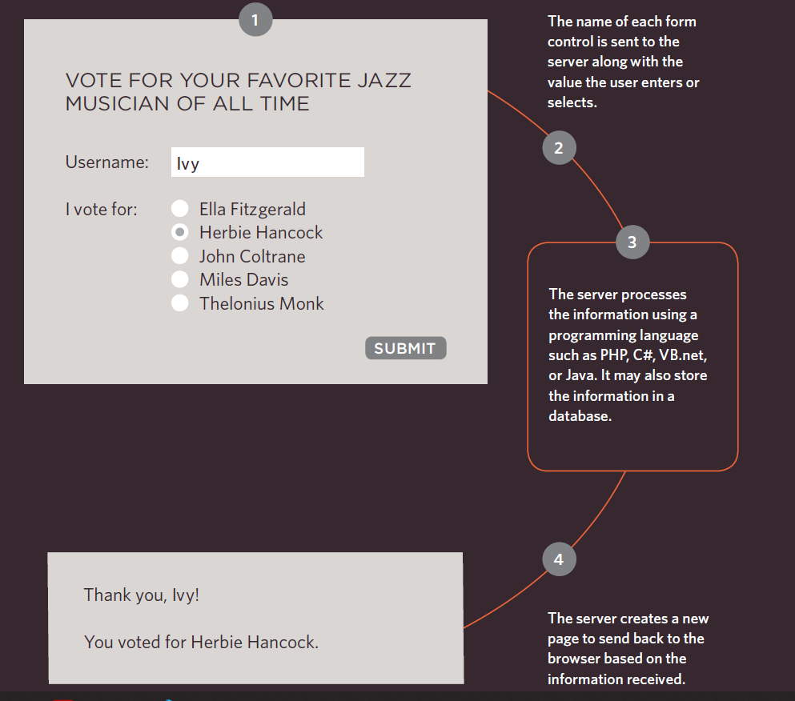

* A form may have several form controls, each
gathering different information. The server
needs to know which piece of inputted data
corresponds with which form element.

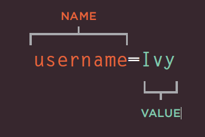
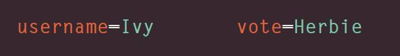

* Form Structure:

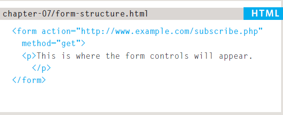

* Text Input:

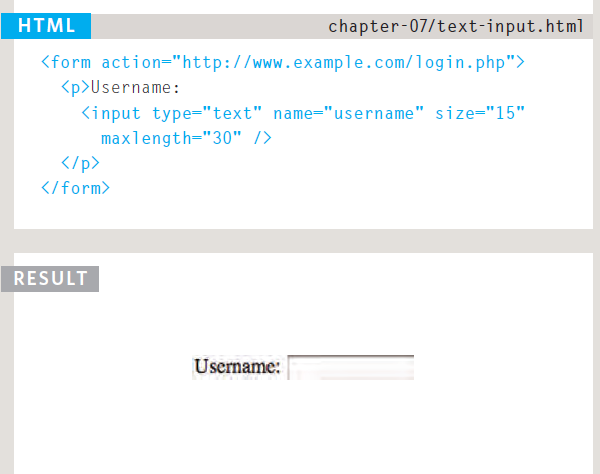

## Chapter 14: “Lists, Tables & Forms”
In this chapter you will learn how to:
1. Specify the type of bullet point or numbering on lists 
2. Add borders and backgrounds to table cells
3. Control the appearance of form controls

#### 1. Specify the type of bullet point or numbering on lists 
1. Bullet Point Styles: list-style-type
The list-style-type property
allows you to control the shape
or style of a bullet point (also
known as a marker).

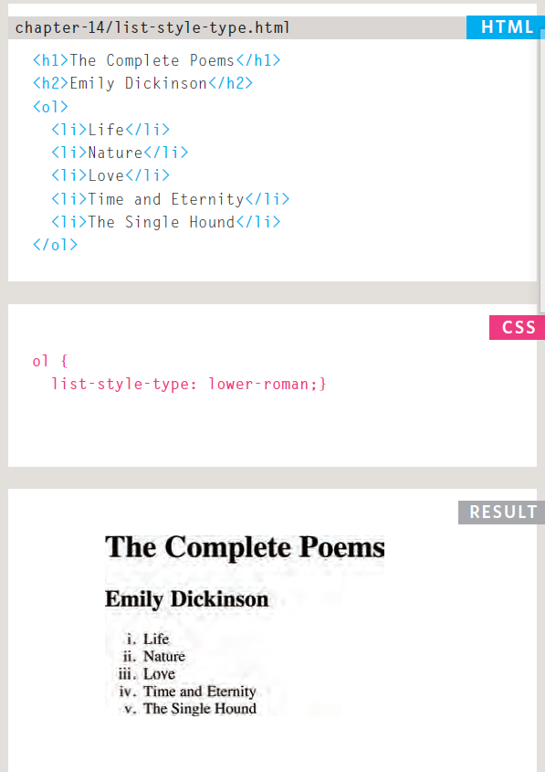

#### 2. Add borders and backgrounds to table cells
1. Table Properties
properties that are commonly
used with tables:
1. width to set the width of the
table
2. padding to set the space
between the border of each table
cell and its content
3. border-spacing
4. border-collapse

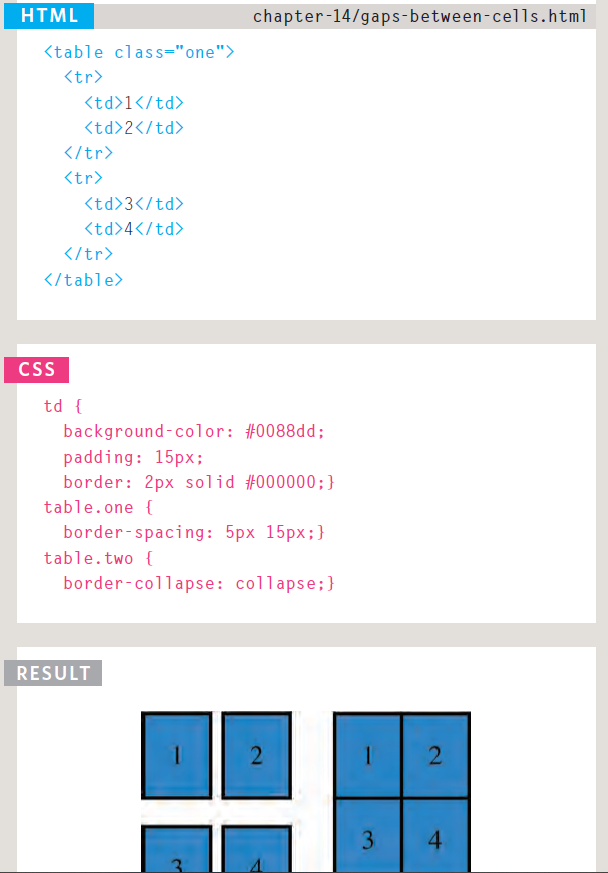

#### 3. Control the appearance of form controls
1. Styling Fieldsets & Legends

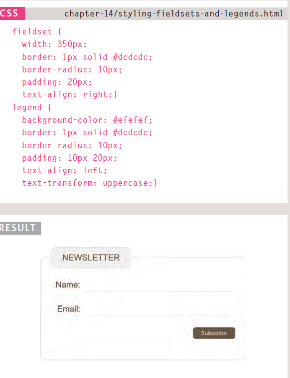

## Duckett JS book:
## Chapter 6: “Events”
* DIFFERENT EVENT TYPES

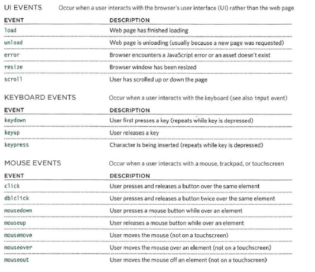

* Here is the syntax to bind an event to an element using an event handler,
and to indicate which function should execute when that event fires:
* EVENT LISTENERS: Event listeners are a more recent approach to handling events.

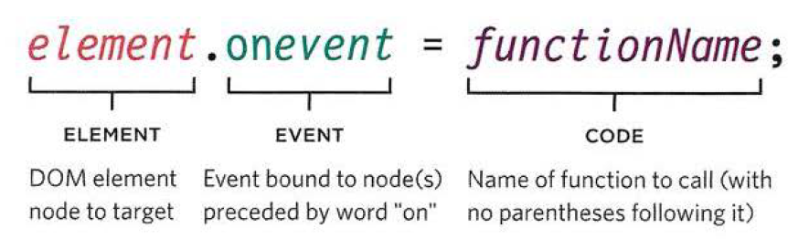

They can deal with more than one function at a time.
Here is the syntax to bind an event to an element using an event listener,
and to indicate which function should execute when that event fires:

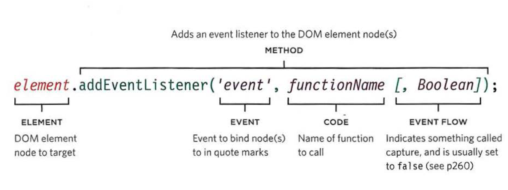

