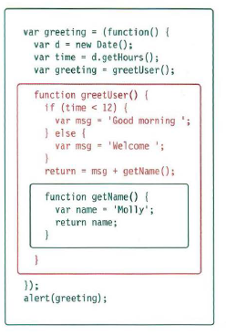
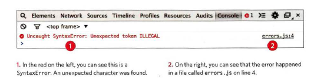
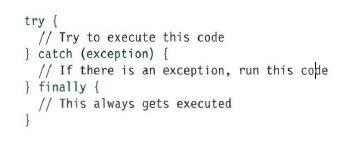

# Readings : Debugging
## Duckett JS book
## Ch. 10, “Error Handling & Debugging”
* This chapter will help you learn
how to find the errors in your code. It will also teach you how
to write scripts that deal with errors.
* ORDER OF EXECUTION: To find the source of an error, it helps to know how scripts are processed.
* EXECUTION CONTEXTS: The JavaScript interpreter uses the concept of execution contexts.
There is one global execution context; plus, each function creates a new
new execution context. They correspond to variable scope.

* UNDERSTANDING ERRORS: If a JavaScript statement generates an error, then it throws an exception.
At that point, the interpreter stops and looks for exception-handling code.
* ERROR OBJECTS: Error objects can help you find where your mistakes are
and browsers have tools to help you read them.

* HOW TO DEAL WITH ERRORS:
1. DEBUG THE SCRIPT TO FIX ERRORS
* Debugging is eliminating potential causes of an error.
* The JavaScript console will tell you when there is a problem with a script,
where to look for the problem, and what kind of issue it seems to be.
* The JavaScript console is just one of severa l developer tools that are
found in all modern browsers.
2. HANDLE ERRORS
* BREAKPOINTS: You can pause the execution of a script on any
line using breakpoints. Then you can check the
va lues stored in variables at that point in time.
* If you set multiple breakpoints, you can step
through them one-by-one to see where values
change and a problem might occur.
* CONDITIONAL BREAKPOINTS: You can indicate that a breakpoint should be
triggered only if a condition that you specify is
met.
* HANDLING EXCEPTIONS: If you know your code might fail, use try, catch, and finally.
Each one is given its own code block.

* TRY: First, you specify the code that you t hink might throw an exception within the try block.
If an exception occurs in thissection of code, control is automatically passed to the
corresponding catch block.
* CATCH: If the try code block throws an exception, catch steps in with an
alternative set of code.
* FINALLY: The contents of the fina1ly code block will run either
way - whether the try block succeeded or failed.