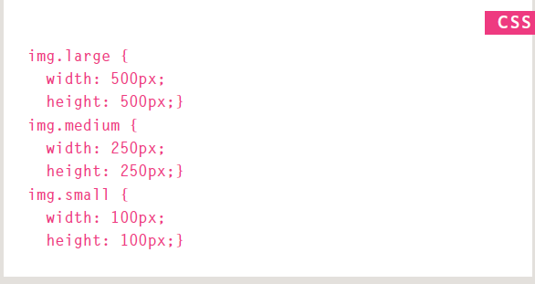
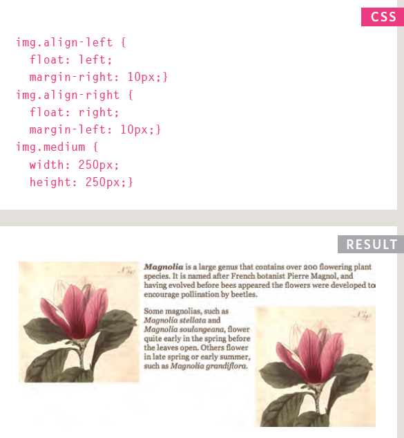
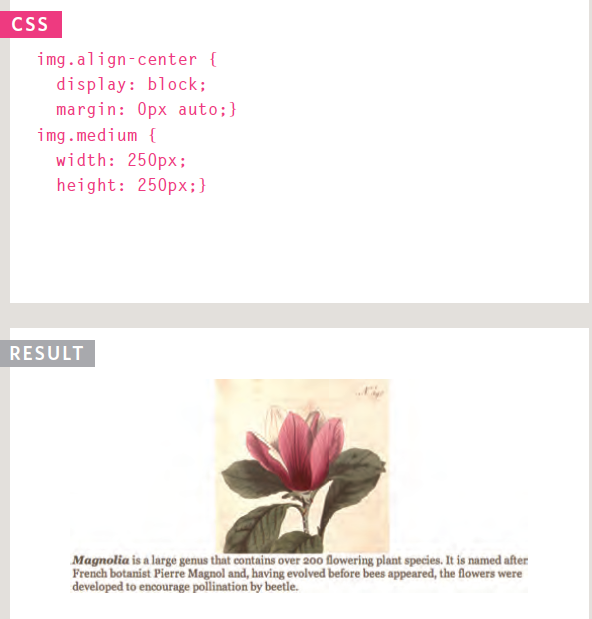
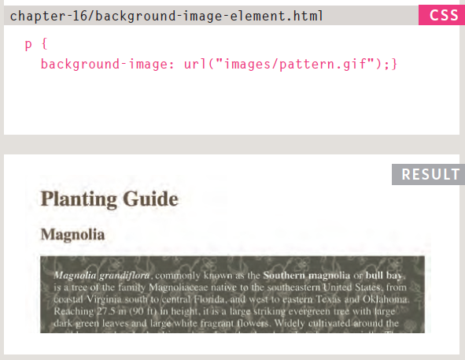
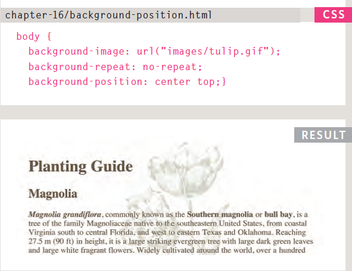
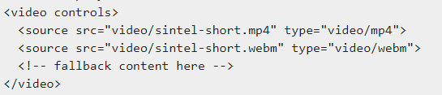
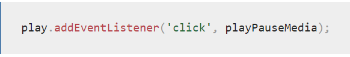
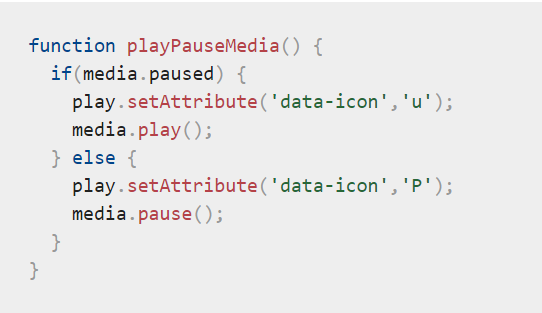

# Readings : Audio, Video, Images
### Duckett HTML book:
### Chapter 16: “Images”
* controll the size of image in css.

* AligNing images Using CSS

* Centering images Using CSS

* Background Images background-image

* Background Position

### Chapter 19: “Practical Information”
* Search engine optimization helps visitors find your
sites when using search engines.
* Analytics tools such as Google Analytics allow you to
see how many people visit your site, how they find it,
and what they do when they get there.
* To put your site on the web, you will need to obtain a
domain name and web hosting.
* FTP programs allow you to transfer files from your
local computer to your web server.
### Chapter 9:Flash, Vedio and Audio
* Since the late 1990s, Flash has been a very
popular tool for creating animations, and later
for playing audio and video in websites.
* Since 2005, a number of factors have meant
that fewer websites are written in Flash or even
use elements of Flash in their pages.
### Video and Audio APIs
* The `<video>` and `<audio>` elements allow us to embed video and audio into web pages.

* Implementing the JavaScript.\

