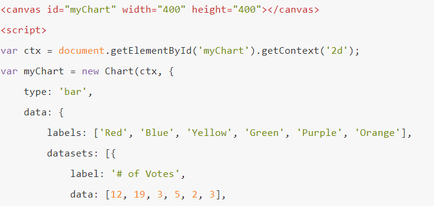
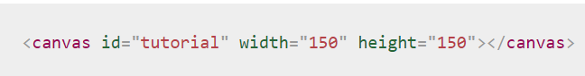
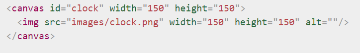

# Readings : Chart.js, Canvas
## Chart.js API
* Charts are far better for displaying data visually than tables.
1. Setting up: The first thing we need to do is download Chart.js.
2. Drawing a line chart.
3. Drawing a pie chart.
4. Drawing a bar chart.

## Canvas API
* The `<canvas>` element.

* Fallback content.

* The rendering context.
The `<canvas>` element has a method called getContext(), used to obtain the rendering context and its drawing functions.
* Drawing rectangles
1. fillRect(x, y, width, height)
Draws a filled rectangle.
2. strokeRect(x, y, width, height)
Draws a rectangular outline.
* Path::
beginPath()
Creates a new path
* Moving the pen::
moveTo(x, y)
Moves the pen to the coordinates specified by x and y.
* Lines::
lineTo(x, y)
Draws a line from the current drawing position to the position specified by x and y.
* Colors
1. fillStyle = color
Sets the style used when filling shapes.
strokeStyle = color
2. Sets the style for shapes' outlines.
* Drawing text
fillText(text, x, y )

